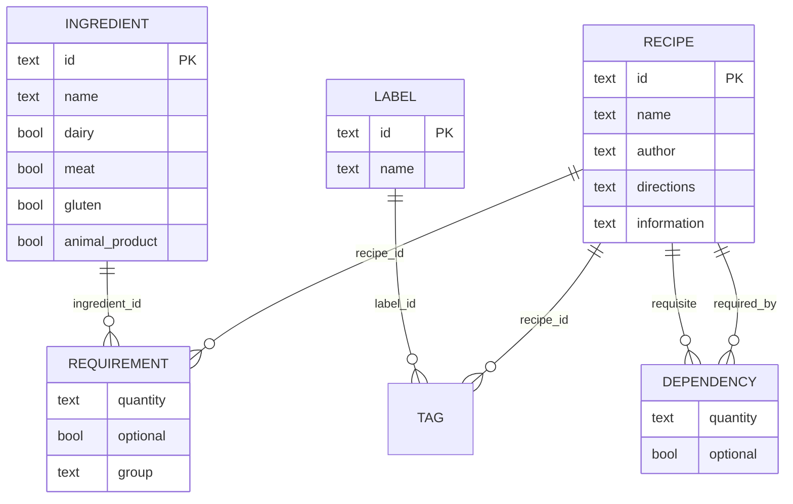

# Knife API — Reference for the Rewrite

As of 2026-10-03

## Overview

Knife v0.3 is a Flask JSON API with 26 routes over 4 resources: ingredients, recipes, labels, and the recipe sub-resources requirements, dependencies and tags. The code in `knife/store.py` is the source of truth here; `api.yaml` is stale (it describes request headers and a `required_id` field that the server no longer reads).

**Response envelope.** Every route returns HTTP 200 with `{"accept": true, "data": <payload>}` on success, or the error status with `{"accept": false, "error": "<message>", "data": <conflict record or null>}`. Routes that return nothing send `data: null`.

**Conventions**

- Request bodies are JSON (`Content-Type: application/json`). A body sent with any other content type is silently treated as empty.
- Lookup filters are query-string parameters.
- IDs are 64-character hex strings: sha256 of the name plus the creation timestamp. They are opaque to clients.
- Names are deduplicated through `simple_name`: lowercase, accents stripped (Unidecode), spaces and apostrophes replaced by `_`. "Crème Brûlée" and "creme brulee" collide.
- No authentication, no pagination, CORS open to all origins.

## Data model

Three entities (Recipe, Ingredient, Label) and three join tables (Requirement, Dependency, Tag). Every column is text or boolean; quantities are free text such as "500g".

Dependency points from Recipe back to Recipe twice: once as the recipe that needs another, once as the recipe that is needed. The dependency graph must stay acyclic.

| Table | Field | Type | Default | Notes |
| --- | --- | --- | --- | --- |
| recipes | id | text, PK | generated | |
| recipes | name | text | required | |
| recipes | simple_name | text | derived | Unique; never sent by clients |
| recipes | author | text | "" | |
| recipes | directions | text | "" | |
| recipes | information | text | "" | |
| ingredients | id | text, PK | generated | |
| ingredients | name | text | required | |
| ingredients | simple_name | text | derived | Unique |
| ingredients | dairy | bool | false | Classification flag |
| ingredients | meat | bool | false | Classification flag |
| ingredients | gluten | bool | false | Classification flag |
| ingredients | animal_product | bool | false | Classification flag |
| labels | id | text, PK | generated | |
| labels | name | text | required | No spaces allowed |
| labels | simple_name | text | derived | Unique |
| requirements | recipe_id | text, PK | | FK recipes.id |
| requirements | ingredient_id | text, PK | | FK ingredients.id |
| requirements | quantity | text | required | |
| requirements | optional | bool | false | |
| requirements | group | text | "" | Groups ingredients within a recipe ("for the sauce") |
| dependencies | required_by | text, PK | | FK recipes.id, the recipe that needs another |
| dependencies | requisite | text, PK | | FK recipes.id, the recipe that is needed |
| dependencies | quantity | text | "" | |
| dependencies | optional | bool | false | |
| tags | recipe_id | text, PK | | FK recipes.id |
| tags | label_id | text, PK | | FK labels.id |

Foreign keys are enforced only in application code; no backend declares them.

## Endpoints

All 26 routes, as the code behaves today. Inputs marked \* are required. "Index" means a list of `{id, name}` objects. Unknown body or query keys are rejected with 400 everywhere.

### Ingredients

| Method | Path | Input | Returns | Errors |
| --- | --- | --- | --- | --- |
| GET | `/ingredients` | query: `id`, `name` (substring, matched on simple_name) | Index | 400 unknown key |
| POST | `/ingredients/new` | body: `name`\*, `dairy`, `meat`, `gluten`, `animal_product` | Ingredient: `id`, `name`, `simple_name`, `classifications{dairy, meat, gluten, animal_product}` | 400 missing name or empty simple_name; 409 duplicate (data = existing index) |
| GET | `/ingredients/{id}` | | Ingredient + `used_in`: index of recipes requiring it | 404 |
| PUT | `/ingredients/{id}` | body: any of the create fields | null | 400; 404; 409 name taken |
| DELETE | `/ingredients/{id}` | | null | 404; 409 still used by a requirement |

### Recipes

| Method | Path | Input | Returns | Errors |
| --- | --- | --- | --- | --- |
| GET | `/recipes` | query: `id`, `name` (on simple_name), `author`, `directions`; all substring | Index | 400 unknown key |
| POST | `/recipes/new` | body: `name`\*, `author`, `directions`, `information` | Recipe: `id`, `name`, `simple_name`, `author`, `directions`, `information` | 400 empty body, missing or empty name; 409 duplicate |
| GET | `/recipes/{id}` | | Recipe + `requirements`, `dependencies`, `tags`, `classifications` | 404 |
| PUT | `/recipes/{id}` | body: any of the create fields | Full recipe, as GET | 400 empty body; 404; 409 name taken |
| DELETE | `/recipes/{id}` | | null; also deletes its requirements, tags and outgoing dependencies | 404 |

### Recipe sub-resources

| Method | Path | Input | Returns | Errors |
| --- | --- | --- | --- | --- |
| GET | `/recipes/{id}/requirements` | | `[{ingredient{id, name}, quantity, optional, group}]` | 404 recipe |
| POST | `/recipes/{id}/requirements/add` | body: `ingredient_id`\*, `quantity`\*, `optional`, `group` | null | 400; 404 recipe or ingredient; 409 already required |
| PUT | `/recipes/{id}/requirements/{ingredient_id}` | body: `quantity`, `optional` | null | 404 requirement |
| DELETE | `/recipes/{id}/requirements/{ingredient_id}` | | null | 404 requirement |
| GET | `/recipes/{id}/dependencies` | | `[{recipe{id, name}, quantity, optional}]` | 404 recipe |
| POST | `/recipes/{id}/dependencies/add` | body: `requisite`\* (recipe id), `quantity`, `optional` | null | 400 missing or self-reference; 404 either recipe; 409 exists or would create a cycle |
| PUT | `/recipes/{id}/dependencies/{requisite}` | body: `quantity`, `optional` | null | 404 dependency |
| DELETE | `/recipes/{id}/dependencies/{requisite}` | | null | 404 dependency |
| GET | `/recipes/{id}/tags` | | Label index | 404 recipe |
| POST | `/recipes/{id}/tags/add` | body: `name`\* (label name, created if new) | null | 400 invalid name; 404 recipe; 409 already tagged |
| DELETE | `/recipes/{id}/tags/{label_id}` | | null | 404 tag |

### Labels

| Method | Path | Input | Returns | Errors |
| --- | --- | --- | --- | --- |
| GET | `/labels` | query: `id`, `name` (substring on name, case-sensitive) | Index | 400 unknown key |
| POST | `/labels/new` | body: `name`\* (no spaces) | Label: `id`, `name`, `simple_name` | 400; 409 duplicate |
| GET | `/labels/{id}` | | `{id, name, tagged_recipes: index}` | 404 |
| PUT | `/labels/{id}` | body: `name` | null | 400; 404; 409 name taken |
| DELETE | `/labels/{id}` | | null; also removes the label from every recipe | 404 |

## Business rules

These are the behaviours a rewrite must preserve; everything else is transport.

- **Unique names.** Recipes, ingredients and labels are unique by `simple_name`. A 409 on create returns the existing record's `{id, name}` in `data`, so a client can reuse it.
- **Label names are single words.** A label name containing a space is rejected with 400.
- **Tagging creates labels.** `POST /recipes/{id}/tags/add` takes a label *name*, reuses the label if its simple_name exists, and creates it otherwise.
- **Ingredients in use cannot be deleted.** Deletion fails with 409 while any requirement references the ingredient.
- **Recipe and label deletes cascade.** Deleting a recipe removes its requirements, tags and the dependencies it declares. Deleting a label removes all its tags.
- **Dependencies form a DAG.** A recipe cannot depend on itself. Before adding A → B, the server walks the graph breadth-first from both A and B and refuses with 409 if either reaches the other.
- **Classification is inherited.** A recipe's `classifications` is the OR of the four flags across its ingredients and, recursively, across every recipe it depends on. It is computed on read and never stored. Optional ingredients still count.
- **Defaults.** Missing `quantity` on a dependency becomes "", missing `optional` becomes false, missing `group` becomes "".

## Errors

All errors come from `knife/exceptions.py`. Only the three AlreadyExists errors fill `data`; every other error sends `data: null`. Uncaught exceptions return 500 with the Python message as `error`.

| Status | Exception | `error` text | `data` |
| --- | --- | --- | --- |
| 400 | InvalidQuery | Invalid parameter: {key: value} | null |
| 400 | EmptyQuery | Expected parameters | null |
| 400 | InvalidValue | Invalid field {field} ({value}) | null |
| 404 | RecipeNotFound | Recipe not found: {id} | null |
| 404 | IngredientNotFound | Ingredient not found: {id} | null |
| 404 | LabelNotFound | Label not found | null |
| 404 | RequirementNotFound | Requirement not found | null |
| 404 | DependencyNotFound | Dependency not found | null |
| 404 | TagNotFound | Tag not found | null |
| 409 | RecipeAlreadyExists | Recipe already exists | existing `{id, name}` |
| 409 | IngredientAlreadyExists | Ingredient already exists | existing `{id, name}` |
| 409 | LabelAlreadyExists | Label already exists | existing `{id, name}` |
| 409 | IngredientInUse | Ingredient in use | null (count kept server-side) |
| 409 | RequirementAlreadyExists | Requirement already exists | null |
| 409 | DependencyAlreadyExists | Dependency already exists | null |
| 409 | DependencyCycle | Dependency cycle detected | null |
| 409 | TagAlreadyExists | Tag already exists | null |

`LabelInvalid` is defined but never raised.

## Quirks in v0.3

Each row below was reproduced against the JSON backend on 2026-10-03, except the Postgres driver, which was not run. None should be carried into the rewrite unless a client depends on it.

| Behaviour | Observed | Fix in rewrite |
| --- | --- | --- |
| Deleting a recipe that others depend on | 200; the dependency rows stay in storage and vanish from the dependants' views without warning | Refuse with 409, as for ingredients, or cascade explicitly |
| Edit endpoints skip type checks | `PUT /ingredients/{id}` with `dairy: "yes"` stores the string "yes" | Validate bodies with a schema on every write |
| Tag add without `name` | 500, "'Label' object has no attribute 'name'" | 400 |
| Renaming a label to its own name | 409, conflicts with itself | Exclude the label's own id, as recipe and ingredient edits do |
| Label lookup | Matches `name`, case-sensitive; `FRENCH` finds nothing. Recipe and ingredient lookups use simple_name | Match simple_name everywhere |
| Substring filters | JSON backend treats the value as a regex, SQL backends as `LIKE` | Pick one and escape input |
| Boolean filters | `GET /ingredients?dairy=true` is 400; flags cannot be filtered | Add flag filters, or a `?diet=vegetarian` style filter |
| Non-JSON bodies | A form-encoded body is read as empty: "Expected parameters" | 415 Unsupported Media Type |
| Requirement `group` | Settable on add, not on edit | Allow on edit |
| Writes return nothing | Most POST/PUT routes return `data: null`; recipe edit returns the full recipe | Return the created or updated resource consistently |
| Verb-in-path routes | `/new` and `/add` suffixes on POST | `POST /recipes`, `POST /recipes/{id}/requirements` |
| `api.yaml` | Documents headers and `required_id`; server reads a JSON body and `requisite` | Generate the spec from code |
| SQLite and Postgres drivers | SQLite broken since models switched to `Field` keys, and `group` is a reserved word; Postgres shares the code pattern (not run) | Use one SQL backend through an ORM or query builder |

## Recommendations for the rewrite

Keep the domain and its rules; replace the transport and storage layers.

1. **Resource-shaped routes.** `POST /recipes`, `PATCH /recipes/{id}`, `PUT /recipes/{id}/requirements/{ingredient_id}` (an upsert replaces add + edit), `PUT /recipes/{id}/tags/{label_name}`. 26 routes collapse to about 20.
2. **Standard HTTP semantics.** 201 + resource on create, 204 on delete, the body itself on success. Drop the `accept` envelope and use RFC 9457 problem details for errors, keeping the conflicting record in a field on 409.
3. **Schema-first validation.** One schema per resource, shared by request parsing, responses and the OpenAPI spec, so `api.yaml` cannot drift again.
4. **Real foreign keys.** One SQL backend (SQLite for local use, Postgres in production) with declared FKs, `ON DELETE` rules and unique indexes on `simple_name`. This replaces most hand-written existence checks.
5. **UUIDs or ULIDs for ids.** Today's sha256(name + time) ids are 64 characters and carry no meaning.
6. **Recursive classification in SQL.** A recursive CTE can compute dependency closure and classification in one query, instead of one query per graph node.
7. **Pagination on list routes**, and filters on the four dietary flags.
8. **Port the API tests first.** `test/api` covers every route over HTTP and can be pointed at the new server to check parity, minus the quirks above.
